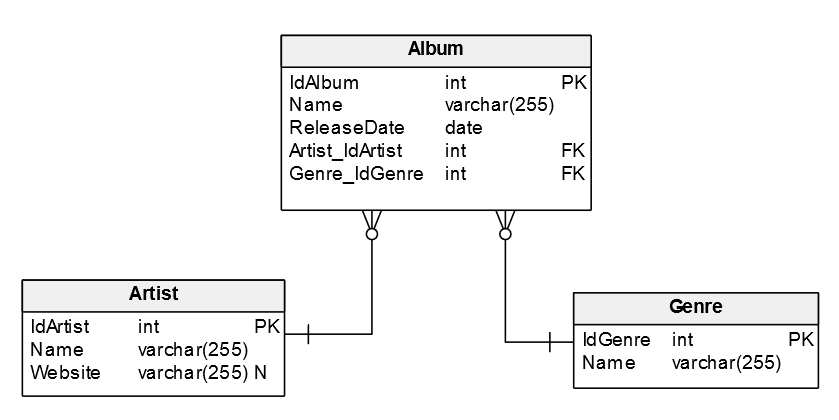
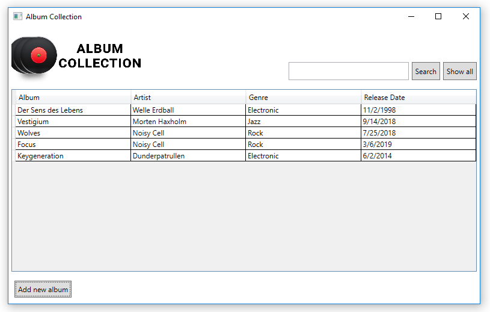
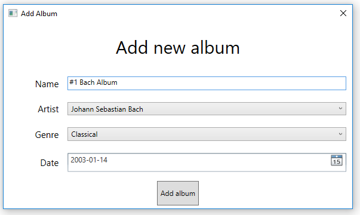

# Album-Collection
This app was made in Visual Studio using WPF. It also uses Entity Framework to connect to the database (in my case MSSQL). Query for the database is located in 'SQLQuery.sql' file and the model looks like this:

# Screenshots

### Features
- DB integration using Entity Framework
- Artist/Album/Genre search
- Sorting data
- Adding new albums
